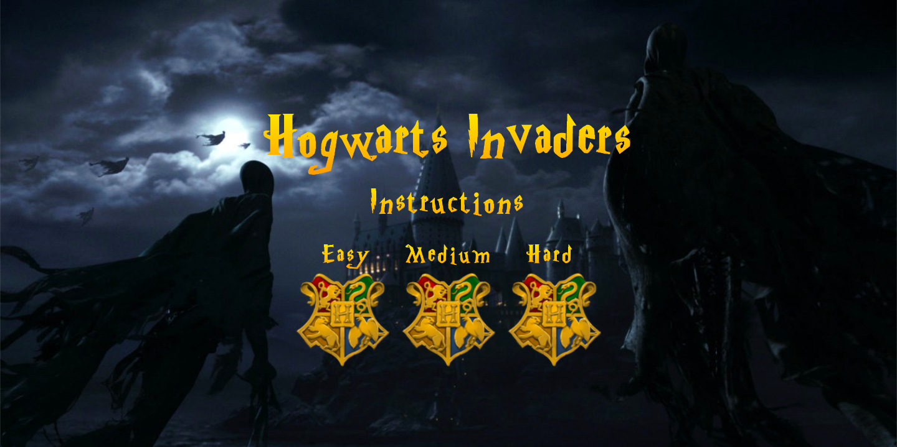
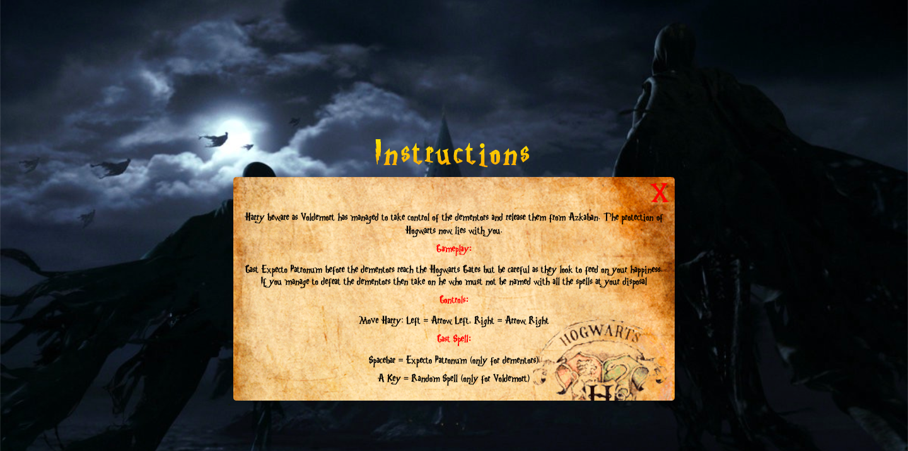
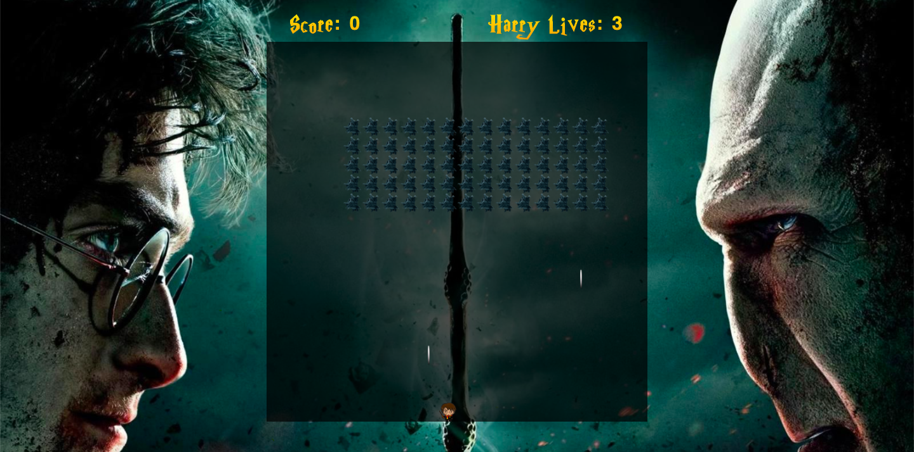
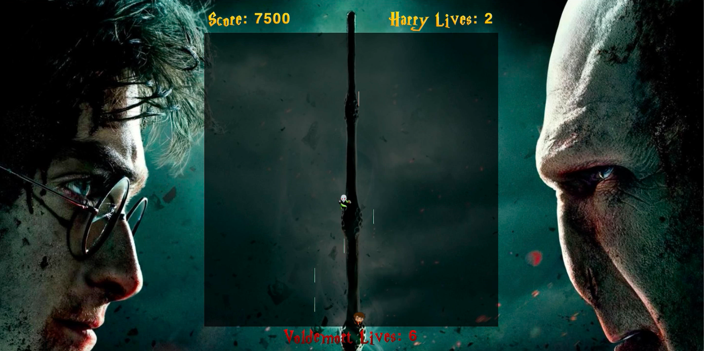

###  General Assembly, Software Engineering Immersive

# HOGWARTS INVADERS 

# Overview 

Hogwarts Invaders was the first project that I completed during a 3 month Software Engineering Immersive course at General Assembly. 

With only three weeks into the course and being a complete novice before the start I was extremely excited about taking on my first front-end development project. 

The task was to create a grid-based game and we were to choose a game from a selection of 10. All the games were given a level of difficulty between 1-3. These games were to utilise 'vanilla' JavaScript, HTML and CSS

Hogwarts Invaders is a level 2 grid-based game which is a take on the iconic _Space Invaders_. This was a solo project with a duration of one week. The aim was to translate the key aspects of Harry Potter into the game and so I focused heavily on animations, using set intervals and timeouts, and also the use of sound effects to create a sense of suspense and intensity around the game. 

I knew this was going to be a challenge due to my very basic understanding of JavaScript and interacting with the DOM, but I was comfortable in my understanding of CSS to make sure the user had a fun and entertaining experience when playing the game.

__Play Hogwarts Invaders [here](https://jamie66m.github.io/project-1/)__

## The Brief

- **Render a game in the browser**
- **Design logic for winning & visually display which player won**
- **Include separate HTML / CSS / JavaScript files**
- Stick with **KISS (Keep It Simple Stupid)** and **DRY (Don't Repeat Yourself)** principles
- Use **Javascript** for **DOM manipulation**
- **Deploy your game online**, where the rest of the world can access it
- Use **semantic markup** for HTML and CSS (adhere to best practices)

## Technologies Used

| Category | List |
| ---- | --- |
| Languages                            | Javascript (ECMAScript6), CSS, HTML5 |
| Typefaces                            | TrueType |
| Text Editor                          | VS Code |
| Browser                              | Chrome |
| Version control | Git and GitHub |

## Aim of the Game

The aim of the game is to move Harry left or right protecting Hogwarts by casting Expecto Patronum to remove the dementors and once all the dementors are removed from the game you will have to take down Voldemort casting from a range of spells.

## Approach

My approach to creating the game was similar to how an author would write a book. I decided I want to create the beginning of the game (the homepage) first, then the game and then the end. The reason I did this is because I wanted to picture the journey of the user through the game and this definitely helped when adding features such as music, font-style and the animations. 

### Homepage

As mentioned above I decided to tackle the Homepage first. I really wanted to create a page where the user (especially Harry Potter fans) immediately felt like they had entered the Harry Potter world and the game was to protect Hogwarts. Therefore, the dementors invading Hogwarts background image, replicating the Harry Potter font-style, using the Harry Potter theme tune and utilising the Hogwarts Crest to display the levels definitely does bring the game to life.

There are two core features to the homepage that I implemented in order that the page didn't feel static and they are the pulsating Hogwarts Crests and the interactive instructions guide. 




__Hogwarts Crest & Instructions__

When the homepage loads the class <strong>pulse</strong> from the <strong>animate.css</strong> file is added to the class <strong>bodyimagebutton</strong>. The Hogwarts Crests also scale when you hover over them. 

```js
  function homePage() {
    document.querySelector('.divinstructions').style.display = 'none'
    document.querySelector('.divinstructions').style.visibility = 'hidden'
    const bodyImageButtons = document.querySelectorAll('.bodyimagebutton')
    for (const bodyImageButton of bodyImageButtons) {
      bodyImageButton.classList.add('pulse')
    }
    backgroundMusic.play()
  }
  window.addEventListener('load', homePage)
```
```css
.pulse {
animation: pulse 3s infinite;
}

@keyframes pulse {
  from {
    -webkit-transform: scale3d(1, 1, 1);
    transform: scale3d(1, 1, 1);
  }

  50% {
    -webkit-transform: scale3d(1.05, 1.05, 1.05);
    transform: scale3d(1.05, 1.05, 1.05);
  }

  to {
    -webkit-transform: scale3d(1, 1, 1);
    transform: scale3d(1, 1, 1);
  }
}
```

The screenshot of the instructions below indicates my first use of an Event Listener in the project and changing the DOM. I used the <strong>mouseover Event Listener</strong> to make the instructions appear and then used the <strong>click Event Listener</strong> to remove the instructions. When these event listeners run I am also pausing and adding sound effects that are relatable to what the user is currently experiencing.



```js
  const instructions = document.querySelector('.instructions')
  instructions.addEventListener('mouseover', () => {
    document.querySelector('.divinstructions').style.display = 'block'
    document.querySelector('.divinstructions').style.visibility = 'visible'
    document.querySelector('.title').style.visibility = 'hidden'
    document.querySelector('.divlevels').style.visibility = 'hidden'
    document.querySelector('.bodyimages').style.visibility = 'hidden'
    document.querySelector('.bodyimages').style.display = 'none'
    maraudersMap.play()
    backgroundMusic.pause()
  })
```


### The Game

For the actual game itself I wanted to change the visualisation and it's intensity in order to create a feeling of battle and this was done with a change of music and background image. 

The game would start when you clicked on one of the Hogwarts Crests and this would render a new index.html depending on what level you chose. When the page renders the grid is created and the game starts.

<strong>Variables</strong>

It was important that I knew what variables I would need from the start as this definitely helped when writing some of the logic and the functionality.

```js
  const width = 20
  const easyGrid = document.querySelector('.easygrid')
  const gridSize = width ** 2
  const cells = []
  let harry = 389
  let voldemort = 229
  const dementors = [23, 24, 25, 26, 27, 28, 29, 30, 31, 32, 33, 34, 35, 36, 43, 44, 45, 46, 47, 48, 49, 50, 51, 52, 53, 54, 55, 56, 63, 64, 65, 66, 67, 68, 69, 70, 71, 72, 73, 74, 75, 76, 83, 84, 85, 86, 87, 88, 89, 90, 91, 92, 93, 94, 95, 96, 103, 104, 105, 106, 107, 108, 109, 110, 111, 112, 113, 114, 115, 116]
  let harryLives = 3
  let lordVolLives = 7
  let score = 0
  let spellPosition
  let allSpellPosition
  const gridTopRow = [0, 1, 2, 3, 4, 5, 6, 7, 8, 9, 10, 11, 12, 13, 14, 15, 16, 17, 18, 19]
  const livesCount = document.querySelector('.lives')
  const scoreCount = document.querySelector('.score')
  const volLivesCount = document.querySelector('.voldemortlives')
```
<strong>Grid</strong>
  - Adding Harry to the Grid
  - Adding Dementors to the Grid
  - Adding Voldemort to the Grid

The game is built using a grid with the dimensions 20 x 20. The grid was created using CSS and JavaScript. Using a for loop I appended the HTML divs as children to the grid and they were also pushed to the cells array. I used flex-wrap and the correct cell dimensions to ensure that the entire grid had cells of equall size.

```js
easyGrid.style.position = 'absolute'
    for (let i = 0; i < width ** 2; i++) {
      const cell = document.createElement('div')
      easyGrid.appendChild(cell)
      cells.push(cell)
    }
``` 

Adding Harry and the dementors to the grid was realitvely straightforwarded. For Harry I assigned the class 'harry' to a single index from the cells array and for the dementors I used a for loop to add the class 'dementors' to an array of indicies from the cells array. For each level I added an extra row.


```js
  function loadDementors() {
    for (let i = 0; i < gridSize; i++) {
      if (dementors.includes(i)) {
        cells[i].classList.add('dementors')
      }
    }
  }
```


### Character Movement

<strong>Harry</strong>

I decided to focus on Harry's movement first as I new that a lot of the same principles would then apply to getting the Dementors and Voldemort to move.

```js 
if (event.key === 'ArrowRight') {
  if (harry === cells.length - 1) {
    return
  }
  cells[harry].classList.remove('harry')
  harry += 1
  cells[harry].classList.add('harry')
} else if (event.key === 'ArrowLeft') {
  if (harry === 380) {
    return
  }
  cells[harry].classList.remove('harry')
  harry -= 1
  cells[harry].classList.add('harry')
```

To move harry from one cell to the other I had to remove the class of harry and then re-add the class to the new cell that harry was on. We would again have to follow the same principle of adding harry to the grid by passing the `harry` variable into the cells array. The more important thing to note here though is for when Harry reached the wall of the grid. In order for the game to not break I had to add checks for both walls. I only used `ArrowRight` and `ArrowLeft` as I didn't want to give Harry the ability to move up the grid.

<strong>Dementors</strong>

This was first real complex functionality that I came across during the project. My original efforts were for the dementors to hit the wall and then move down and then move across to the other wall just like the original space invaders. However, I found the logic for this challenging at the time and therefore came up with an alternative solution to use a setInterval and setTimeouts. 

I created three separate functions for direction of the dementors movement and then called these functions in a `dementorMove()` function which was then called in the `gameStart()` function. 

```js
function moveDown() {
    dementors.forEach(dementors => {
      cells[dementors].classList.remove('dementors')
    })
    for (var i = 0; i < dementors.length; i++) {
      dementors[i] += 20
    }
    dementors.forEach(dementors => {
      cells[dementors].classList.add('dementors')
    })
  }
```
The code shown above is to show how I moved the dementors down the grid. I had used the forEach Array method to cycle through the array of dementor positions so that I could remove and add the dementor class to the cells array. To move all the dementors I used a for loop going through the length of the dementors array and this was because there were going to be moments that dementors were going to be removed from the game and so for it not to break it was important to loop over the length of the array. To move down you need to add the size of a cell grid, hence `+= 20`.

```js
  function dementorMove() {
    const dementorMoveInterval = setInterval(() => {
      setTimeout(() => {
        moveDementors()
      }, 750)
      setTimeout(() => {
        moveDown()
      }, 1250)
      setTimeout(() => {
        moveLeft()
      }, 1750)
      for (let i = 0; i < dementors.length; i++) {
        if (dementors[i] >= 359) {
          clearInterval(dementorMoveInterval)
          loseGame()
        }
      }
    }, 2000)
  }
```

This was the first use of a setInterval and setTimeout in the project. The major challenge here was getting the dementors to stop moving and I did this by clearing the setInterval when the dementors or dementor reached any cell on the bottom row of the grid. This would be one of the scenarios where the player would lose the game. The length of time for the setInterval and setTimeout varied between each level. Here I am showing you the code for the hardest level.

<strong>Voldemort</strong>

Voldemort would appear if the length of the demontors was equal to 0. At this point I would need to clear the dementor spells interval which will be shown in more depth later and also.

```js
else if (dementors.length === 0) {
        clearInterval(dementorSpellInterval)
        setTimeout(() => {
          cells[arrayDementorSpell].classList.remove('dementorSpell')
        }, 60)
        voldemortAppear()
      }
```

```js
  function voldemortAppear() {
    for (let i = 0; i < gridSize; i++) {
      if (i === voldemort) {
        cells[i].classList.add('voldemort')
      }
    }
    document.querySelector('.voldemortlives').style.visibility = 'visible'
    volLivesCount.innerHTML = `Voldemort Lives: ${lordVolLives}`
    darkLordSpell()
    moveVoldemort()
    gameMusic.pause()
    expectoPatronumSound.pause()
    voldemortAppearMusic.play()
  }
```

I originally wanted the appearance of voldemort to be a bit more dramatic by fading him in and having him cover multiple cells. However, I struggled to implement this and therefore the alternative was to change the music to be more intense, make voldemort move faster across the screen and reduce the time it took for voldemort to cast a spell. The movement of voldemort is very similar to that of the dementors but I wanted voldemort to remain on the same row and not move down the grid. A challenge I faced though was preventing voldemort from wrapping down the grid if he passed through a wall but I knew if I adjusted to the setTimeouts that this could be solved. Another reason for not wanting voldemort to get to the bottom was to try and replicate a battle between Harry and voldemort that they would be standing toe-to-toe against each other in battle until the other defeated the other.

A final note on voldemorts appearance was that Harry's lives would increase by two if he managed to remove all the dementors.

```js
  if (dementors.length === 0) {
     voldemortAppear()
     harryLives += 2
     livesCount.innerHTML = `Harry Lives: ${harryLives}`
     console.log(harryLives)
     voldemortLaugh.play()
   }
```




### Character Spells


### Character Lives


### Winning, Losing and Resetting the Game

- Harry Movement
- Harry Spells
  - Harry Spell Expecto Patronum against Dementors
    - Removing Dementor Life + Adding Score
  - Harry All Spells vs Voldemort
    - rotating through the different sounds
    - Removing Voldemort Life + Adding Score
- Dementor Movement
  - Set Intervals
- Dementor Spells
  - Randomising
- Voldemort Appearance
  - Once dementors were all removed
  - Adding on 2 lives to Harry 
- Voldemort Movement
  - Same principle as dementors 
- Harry Lose Life
  -  Sounds and losing a life
- Voldemort lose life
  - Randomised sounds and losing a life
  - Score increased by 500 every time Voldemort lost a life
- Levels
  - How I created three difficulties
    - What I was doing originally but then changed the day before that I had separate HTMLs

- Win Game, Lose Game, Restart Game, Go back to Homepage
  - Use of animations on Harry and the Snitch
  - Victory Music
  - Loser Music
  - Changing the state of the DOM


## Winners and Blockers

### Winners

  - The Music and Images
    - Getting all the sound features and being able to implement them correctly and pause them when necessary.
    - The images reflect exactly what the game is about and what is happening in the game.
  - The User Experience
    - Design of the game
  - It is true to Harry Potter
    - The use of animations gives it that magical touch.
  - The range of components and different areas of logic and functionality 
  - I had issues removing the spells from both Harry and the Dementors when they hit either the top or the bottom of the grid.
  - It took me a while to write the correct code to randomise the sound effects for the harry's spells at voldemort and when voldemort would lose a life.
  - Changing the score. 
    - Constantly got stuck on 100
  - Originally I had one level and from the homepage I would just change the DOM to remove everything on the homepage and then show the game. However, this was relatively impractical and came with a few bugs. It was only till when on the final evening of the project when I decided to implement levels that I would make the homepage and all three levels separate HTML files. This has slightly slowed down the rendering of each page however, it has definitely improved the overall performance of the game.

### Blockers and Challengers

  - I wanted to have the dementors moving to the wall of the grid, then down the grid by one row and then move in the opposite direction to the other wall. However I struggled with the logic and functionality of this and therefore stuck to using set intervals and timeouts.
  - Potentially spent to much time focusing on the design on certain components of the game and could have introduced extra features which are mentioned below.
  - Should have planned to incorporate levels at the beginning as I could have avoided making so many last minute changes.
  - Getting the dementors spells to fire from the front row.

## Future features
 -  If the spells collide then they are removed.
 -  Have voldemort appear by fading him and scaling him
 -  Be able to block spells
 -  Make the game mobile
 -  Make Harry's and Voldemort's movement fluid across the grid
 -  Scorebored feature


## Key learning areas